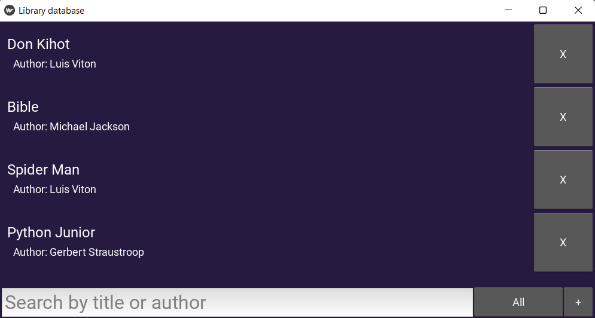
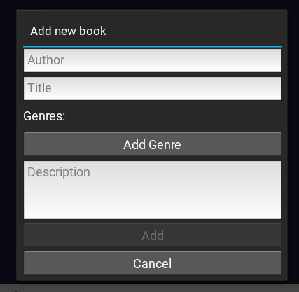

# GUI Software for managing library database

<p align="center">
 <a href="https://zelenka.guru/czaralex/" target="_blank">Zelenka</a>｜  <a href="https://t.me/nooneemee" target="_blank">Telegram</a>
</p>

Welcome to the official repository of LibraryDatabase. This application will help you manage your library database. With it you can add and remove books.

Table of Contents

1. [Introduction](#introduction)
2. [Quickstart](#quickstart)
    - [Environment Requirements](#environment-requirements)
    - [Installing modules](#installing-modules)
    - [Setting Up](#setting-up)
3. [Launching](#launching)


## Introduction

In the program, books are displayed as a list; you can click on them to view full information; you can also delete it by clicking on the corresponding button on the right. Here, on the main screen, you have access to a line to search for books by title or author, and there is also a filter by genre.


> Main menu

<br>
<br>


> Book information

<br>
<br>

Next to the search line there is a button, when clicked, a menu will open for adding a new book. Here you can indicate the title of the book, its author, description, and genres.


> Adding new book

<br>
<br>

## Quickstart

### Environment Requirements

#### Option 1: Build Env

To run the program, you'll need the following environment setup:
- Python 3.7 or higher

Creating virtual environment
```bash
python -m venv .venv
```

Activating virtual environment
```bash
.venv\Scripts\activate
```

Updating PIP
```bash
python -m pip install --upgrade pip
```

### Installing modules

Please ensure all dependencies are installed.
```bash
python -m pip install -r requirements.txt
```

`requirements.txt` listed all necessary libraries and their versions.

### Setting Up
Open `settings.py`, make changes by selecting the database type and editing the data to connect to it. For SQLite, you do not need to set up a connection, just enter a name.

```python
DB_TYPE = DBType.SQLITE

DB_HOST = '127.0.0.1'
DB_USER = 'library_user'
DB_PASS = 'library_pass'
DB_NAME = 'library'
```

## Launching

Now you can run the program by running file main.py, or via the console:
```bash
python main.py
```
